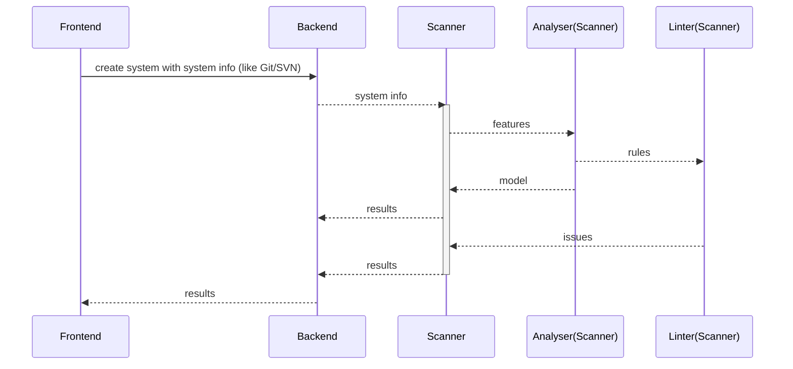

## NextGen Architecture solution: Evolution you architecture in programming way.

- [x] [ArchGuard](https://github.com/archguard/archguard) - connect scanner and show data.
- [x] [ArchGuard frontend](https://github.com/archguard/archguard-frontend) - visualization results & dashboard

